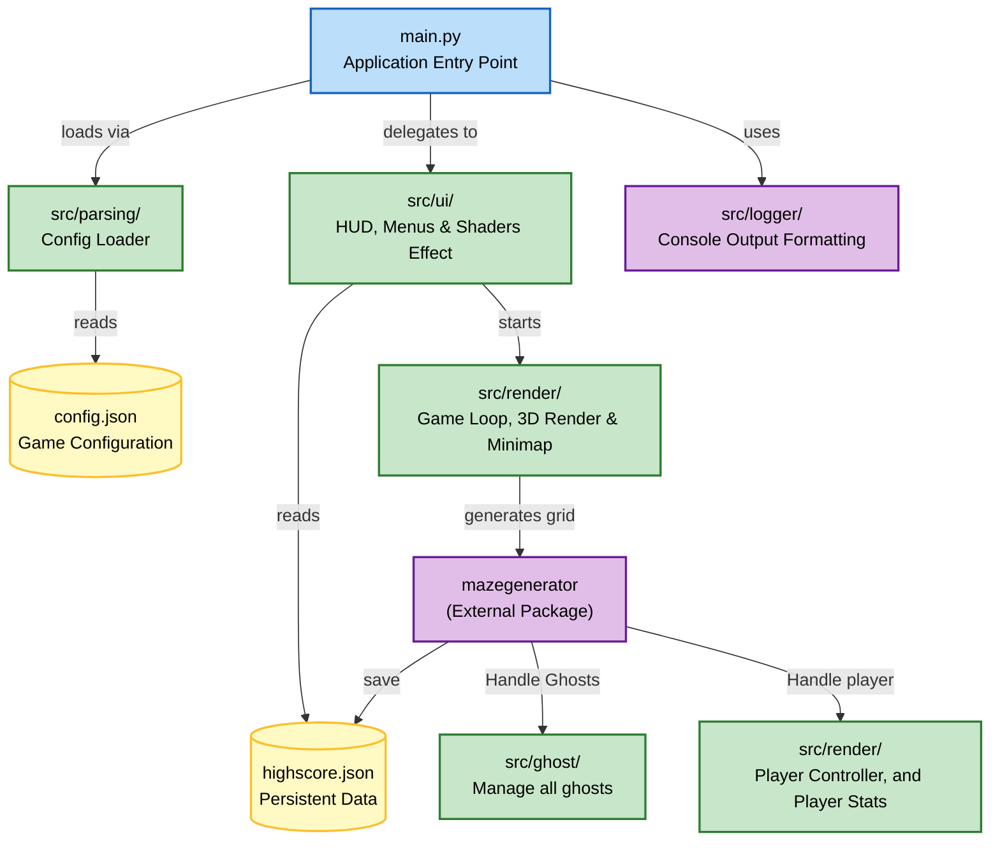
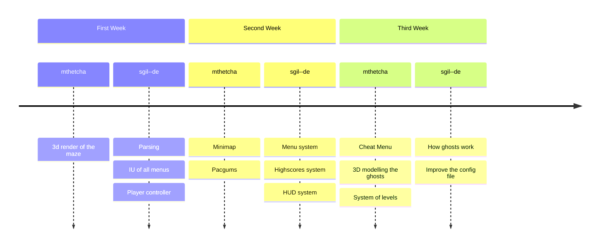

*This project has been created as part of the 42 curriculum by sgil--de, mthetcha.*

# Pac-Man: Ghosts! More ghosts!

## 1. Description
A modern Python and 3D recreation of the classic arcade game Pac-Man. This project implements a fully playable game featuring procedurally generated mazes, classic ghost AI behaviors and a persistent highscore tracking.

## 2. Instructions

### Installation
To install all required dependencies (including the external maze generator) using the provided Makefile:
```bash
make install
```

### Execution
Launch the game by providing the configuration file:
```bash
make run
```

### Clean up

Remove the virtual environment and pycaches:
```bash
make clean
```

### Mypi and Flake8:
**Normal:**
```bash
make lint
```

**Strict:**
```bash
make lint-strict
```


### Cheat Menu
Open the Cheat menu with the konami code
```
↑ ↑ ↓ ↓ ← → ← →
```

## 3. Configuration
The game is using the file `config.json` to store the data of the maps.

- `highscore_filename`: Path to save highscores (e.g., `"highscore.json"`).
- `level`: List containing levels (default width: 15, height: 20, level_max_time: 90, pacgum: 42)
- `lives`: Starting lives for the player (default: `3`).
- `seed`: Fixed seed for the levels generation (default: `42`).
- *Scoring:* `points_per_pacgum` (default: 10), `points_per_super_pacgum` (default: 50), `points_per_ghost` (default: 200).
If invalid or missing keys are provided, the game clamps to safe default values without crashing.

```bash
{
    "highscore_filename": "highscore.json", // File where highscores are saved

    "level": [ // List of available difficulty levels
        { "name": "easy", "width":8, "height": 10, "level_max_time": 90, "pacgum": 15},
        { "name": "medium", "width":10, "height": 20, "level_max_time": 120, "pacgum": 30},
		{ "name": "medium2", "width":20, "height": 10, "level_max_time": 240, "pacgum": 30},
        { "name": "hard" }
    ],

    "lives": 3, // Number of lives the player starts with

    "points_per_pacgum": 10, // Points earned for each pacgum eaten
    "points_per_super_pacgum": 50, // Points earned for each super pacgum eaten
    "points_per_ghost": 200, // Points earned for each ghost eaten

    "seed": 42, // Seed used for random generation (for reproducibility)

    "fov": 90.0 // Fov used for the camera
}
```


## 4. Highscore System
Player highscores are stored persistently in a local JSON file (`highscore.json`).
Loaded at startup, it accepts non-negative scores and player names (max 10 alphanumeric characters). At the end of a game, players are prompted to save their score, which is inserted and sorted securely.

## 5. Maze Generation
We integrate the external `A-Maze-ing` package (`mazegenerator-2.0.1` in the `dependencies/` folder) without modifying its source.
The package's interface is called dynamically to build the grid. We use the parameter `PERFECT=False` to ensure the generated maze includes loops and interconnected corridors, representing a true Pac-Man experience rather than a strict dead-end maze. The first level utilizes the seed provided in the configuration, while later levels are generated dynamically.

## 6. Implementation

The application is structured into a modular, object-oriented pipeline located in the `src/` directory:
- **`parsing/`**: Safely loads and parses `config.json`, handling errors to avoid tracebacks.
- **`render/`**: render the graphics (3D rendering, minimap, player controller) and game loop execution.
- **`ui/`**: Manages visual components, encompassing menus (Main, Pause, Game Over), the in-game HUD, cheat inputs, and graphical shaders effects (e.g., VHS styles).
- **`ghosts/`**: Manage the AI entities (`Blinky`, `Pinky`, `Inky`, `Clyde`). Each extends a `ghost_base` module, featuring unique pathfinding and state-machine behaviors (Chase, Frightened, Respawn).
- **`logger/`**: Custom colored console output to track engine states and handle exceptions gracefully.


## 7. General Software Architecture



## 8. Project Management



## 9. Resources

- **References:** Inspired by the original game
- **Peer-to-peer learning:** Code reviews and discussions
- **README Markdown:** https://docs.github.com/fr/get-started/writing-on-github/getting-started-with-writing-and-formatting-on-github/basic-writing-and-formatting-syntax
- **Mermaid:** Diagrams in the readme (https://mermaid.js.org/)
- **AI Usage:** It was used to make the Ursina graphics library easier to understand
